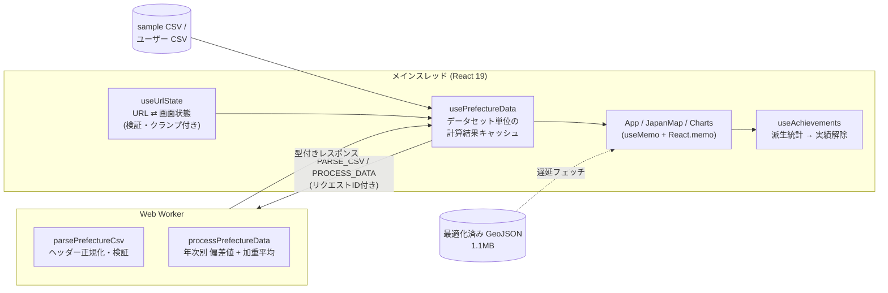

# 🗾 Utopia Finder (FCTX Japan Data Map)

<p align="center"><a href="README.md">English</a> | <b>日本語</b></p>

[](https://github.com/futurecortexlabs/FCTX-Japan-Data-Map/actions/workflows/deploy.yml)


**▶ デモ: https://futurecortexlabs.github.io/FCTX-Japan-Data-Map/**

「あなたにとっての理想の地（ユートピア）をデータから見つけ出す」をコンセプトにした、**遊び心100%のエンタメ系データ可視化ダッシュボード**です。

47都道府県 × 12指標のオープンデータを年次ごとに偏差値化し、ユーザーが設定した価値観（ウェイト）で総合スコアを再計算して、地図・ランキング・チャートにリアルタイム反映します。一見すると真面目な分析ツールですが、格闘ゲーム風のVSモードや、隠しコマンドによるレトロRPGモードなど、思わず触りたくなる「エンタメ機能」が多数搭載されています。

---

## ✨ 主な機能

### 🎯 理想の地を探す（コア機能）
- **Utopia スライダー (レーダーチャート)**: 「生活費の安さ」「食・娯楽の充実」「自然・環境」「都市インフラ」などの重みをスライダーで調整し、あなたの価値観にマッチした都道府県をリアルタイムで再計算します。
- **インタラクティブな日本地図**: 総合スコアや個別データ（地価、スタバ数、花粉の少なさなど全12種類）に合わせて、都道府県の色がシームレスに変化します。
- **トップ5ランキングチャート**: 選択した指標に基づく全県の順位リストと、上位5県を示すバーチャートを表示します。
- **時系列アニメーション**: タイムラインシークバーで、過去から現在までのデータの変遷（スタバの全国進出の歴史など）を自動再生できます。
- **共有可能な URL**: 指標・年・選択中の県・8種類すべてのウェイトが URL に保存され、リンクを送るだけで同じ分析画面を再現できます。
- **CSV インポート**: 独自データを読み込んで可視化できます（日本語ヘッダー・表記ゆれにも対応）。

### 🎮 実用＆エンタメ機能
- **🔥 FIRE シミュレーター**: 「もし東京からこの県に移住したら、何年早くアーリーリタイア（FIRE）できるか？」を資産推移グラフでシミュレーションします。
- **🗣️ AI市長コンシェルジュ**: あなたの価値観に合わせて移住アドバイスを生成（外部 API 不要のルールベース診断エンジン）。「フルボイス再生」をオンにすると、Web Speech API を使った「市長風のクセのある声」で熱っぽく語りかけてきます。
- **☁️ ウェザーエフェクト**: 「魅力度」なら桜の花びら、「地価」ならお札など、指標に合わせたパーティクルが降ってきます。
- **⚔️ VS デュエルモード**: 格闘ゲームの対戦画面のようなスプリットスクリーンで、2つの都道府県のステータスを比較して戦わせることができます。
- **🎫 搭乗券（Boarding Pass）発行**: 移住先を決定すると、SNSシェアに最適な「あなた専用の航空券」が発行され、紙吹雪でお祝いされます。
- **🏆 アチーブメント（実績解除）**: 特定の条件を満たすとトースト通知とともにバッジが解除されるゲーミフィケーション要素です。

### 🕹️ 隠し要素「レトロRPGモード」
キーボードで**コナミコマンド（↑ ↑ ↓ ↓ ← → ← → B A）**を入力すると、アプリ全体が8ビットのレトロRPG風に変身します。
- ドット絵フォントとブラウン管の走査線エフェクト、チップチューンのBGM
- この状態で「VSデュエルモード」を開くと、「こうげき」「ぼうぎょ」コマンドで戦う**ターン制RPGバトル**が始まります。

---

## 🏗️ アーキテクチャ



| レイヤー | 役割 | 主なファイル |
| --- | --- | --- |
| **ドメインロジック** (純粋関数・カバレッジ 96%) | 偏差値計算、スコアリング、CSV 正規化、生活費モデル、FIRE 試算 | `src/utils/` |
| **Worker 境界** | 判別可能ユニオン型のメッセージプロトコル | `src/workers/` |
| **状態管理フック** | URL 同期、Worker 通信、永続化、実績 | `src/hooks/` |
| **UI** | 地図・チャート・モーダル | `src/components/` |

### 技術的なポイント

- **重い計算は Web Worker で**: スコア計算と CSV 解析を Worker にオフロード。リクエストごとに単調増加 ID を振り、スライダー連打時に「古い計算結果が新しい結果を上書きする」レースを防止しています。計算結果はデータセット × ウェイト単位でメモ化。
- **マウス追従で再レンダーしない**: パララックス背景は framer-motion の `MotionValue` で DOM を直接更新し、`mousemove` のたびに App 全体が再レンダーされる構造を解消。
- **Leaflet と React の橋渡し**: Leaflet のイベントハンドラは初回バインド時のクロージャを保持するため、最新 props を ref / `useEffectEvent` 経由で参照。レイヤーを再生成せずスタイルとツールチップのみ差し替えます。
- **外部入力は全て検証**: URL パラメータ（未知の指標名・範囲外ウェイト・重複コード）、localStorage（壊れた値・旧スキーマ）、CSV（不正な都道府県コード）はすべて型ガード／クランプを通してから採用。Leaflet の tooltip に入るユーザー由来文字列は HTML エスケープ（XSS 対策）。
- **React Compiler 準拠**: `eslint-plugin-react-hooks` v7 の `purity` / `set-state-in-effect` ルールを含め lint エラー 0。effect での state 同期を「レンダー中の導出」や `key` による再マウントに置き換えています。
- **アクセシビリティ**: モーダルの `role="dialog"`、アイコンボタンの `aria-label`、ランキング行のキーボード操作 (Enter / Space) と `aria-selected`、指標ボタンの `aria-pressed`、`prefers-reduced-motion`（パーティクル・装飾アニメーション停止）/ `prefers-color-scheme` の尊重。
- **障害の局所化**: 地図・ランキング・詳細パネル・チャートをそれぞれ Error Boundary で囲み、1 つのウィジェットの描画エラーで画面全体が落ちないようにしています（入力が変わると自動で復帰を試行）。
- **フレームワークのバグへの対処**: E2E テストで「指標を切り替えても地図の色が変わらない」不具合を検出。原因は React 19.2 の本番ビルドで `React.memo` 化されたコンポーネント内の `useEffectEvent` が初回クロージャのまま更新されないことで（開発ビルドでは再現しない）、依存関係を明示した `useCallback` + `useEffect` に置き換えて回避しています。

---

## 🚀 パフォーマンス

| 項目 | Before | After |
| --- | --- | --- |
| 日本地図 GeoJSON | 13.4 MB (gzip 1.23 MB) | **1.1 MB (gzip 334 KB)** ― 約 1/4 の転送量 |
| 初回ロードの JS (gzip) | 約 320 KB | **約 208 KB** ― チャートライブラリ (113 KB) を遅延ロード化 |
| 本番ビルド時間 | 5.6 s | **0.5 s** |
| マウス移動時の React 再レンダー | 毎イベントで App 全体 | **0 回** |
| ウェイト変更時の Worker | 毎回 破棄 → 再生成 | **1 インスタンスを再利用** |

GeoJSON は `scripts/optimize-geojson.mjs` で最適化しています（座標精度 4 桁 ≒ 11m への丸め → Douglas–Peucker 法による単純化 → 極小離島の除去 → minify）。丸めを単純化の前に行うことで、隣接県の共有境界点が同じ座標に揃い、境界の隙間を防いでいます。

加えて `React.lazy` でモーダル類・チャート・FIRE タブを遅延ロードし、ベンダーチャンク（React / Leaflet / Recharts / アニメーション）を分割してキャッシュ効率を高めています。チャンク分割は Rolldown の `codeSplitting.groups` を優先度付きで使い、パッケージ名の完全一致で割り当てています（部分一致だと recharts 専用の依存が React 側に混ざり、遅延ロードのはずの 400 KB のチャートチャンクが初回に preload されていました）。

---

## 🛠️ 開発

**必要環境**: Node.js 22 以上（`.nvmrc` 参照）

```bash
npm install
npm run dev          # 開発サーバー (http://localhost:5173/FCTX-Japan-Data-Map/)
```

| コマンド | 内容 |
| --- | --- |
| `npm run check` | 型チェック + lint + テストをまとめて実行 |
| `npm run test` / `test:watch` | Vitest によるユニット / コンポーネントテスト |
| `npm run test:e2e` | Playwright による E2E テスト（本番ビルドをデスクトップ・モバイルで検証） |
| `npm run test:coverage` | カバレッジレポート (`coverage/index.html`) |
| `npm run build` | 型チェック + 本番ビルド |
| `npm run optimize:geojson` | 地図データの再最適化 |

### CI/CD

GitHub Actions で PR と `main` への push ごとに **型チェック → lint → ユニットテスト（カバレッジ）→ ビルド** と、並行して **Playwright E2E（デスクトップ / モバイル）** を実行し、両方を通過した場合のみ `main` ブランチの成果物を GitHub Pages にデプロイします。E2E が失敗した場合はトレース付きレポートがアーティファクトとして保存されます。カバレッジとバンドルサイズはジョブサマリーに出力されます。リポジトリを `main` のみに保つため、Dependabot の定期的なバージョン更新 PR は停止しています。この設定は Dependabot のセキュリティ更新には影響しません。

### データパイプライン

`scripts/fetch_*.py` で各種オープンデータを取得し、`scripts/build_prefecture_dataset.py` で `src/data/sample_prefecture_data.csv` を生成します。同梱データの整合性（全年度で 47 都道府県が揃っていること等）はテストで検証しています。

---

## 📊 可視化できる主な指標
- **生活・インフラ**: 地価の安さ、人口、上場企業数、病院数、子育て環境スコア
- **食・カルチャー**: ラーメン屋店舗数、スターバックス店舗数、温泉地数
- **自然・環境**: 観光魅力度、年間日照時間、花粉の少なさ

各指標は年度ごとに偏差値（平均 50・標準偏差 10）へ正規化され、「地価」「花粉」のように低いほど望ましい指標は反転して扱います。

---

## 💻 技術スタック

- **フロントエンド**: React 19, TypeScript (strict), Vite 8
- **スタイリング**: Tailwind CSS 4
- **アニメーション**: Framer Motion, canvas-confetti
- **地図描画**: React Leaflet（ベースマップ: [国土地理院 淡色地図](https://maps.gsi.go.jp/development/ichiran.html)）
- **グラフ描画**: Recharts
- **テスト / 品質**: Vitest, Testing Library, Playwright, ESLint (typescript-eslint, react-hooks v7), GitHub Actions

## 🗺️ データ出典
- 地図タイル: 国土地理院
- 都道府県境界: [dataofjapan/land](https://github.com/dataofjapan/land)

---

## 📜 ライセンス
本アプリケーションは [MIT License](./LICENSE) の下で公開されています。
