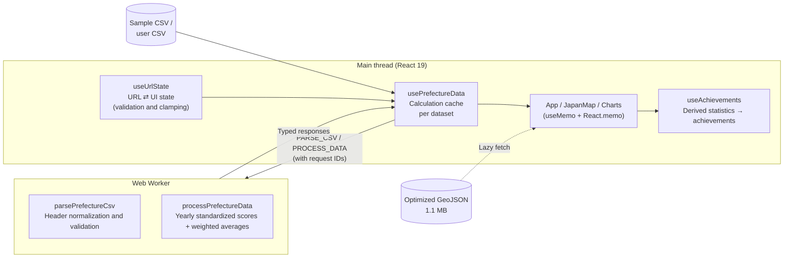

# 🗾 Utopia Finder (FCTX Japan Data Map)

<p align="center"><b>English</b> | <a href="README.ja.md">日本語</a></p>

[](https://github.com/futurecortexlabs/FCTX-Japan-Data-Map/actions/workflows/deploy.yml)


**▶ [Open the live demo](https://futurecortexlabs.github.io/FCTX-Japan-Data-Map/)**

A **playful data visualization dashboard built for entertainment**, with a simple idea: find your ideal place to live — your own utopia — through data.

The dashboard normalizes open data for 47 Japanese prefectures across 12 metrics into yearly standardized scores. It recalculates an overall score using the weights you choose and updates the map, rankings, and charts in real time. Alongside the analysis tools, it includes interactive extras such as a fighting-game-style VS mode and a hidden retro RPG mode.

---

## ✨ Features

### 🎯 Find your ideal place to live

- **Utopia sliders and radar chart**: Adjust the importance of low living costs, food and entertainment, nature and the environment, urban infrastructure, and other priorities. The dashboard recalculates which prefectures match your values in real time.
- **Interactive map of Japan**: Prefecture colors change smoothly to reflect the overall score or any of the 12 individual metrics, such as land prices, Starbucks locations, or low pollen levels.
- **Top-five ranking chart**: View a ranked list of all prefectures and a bar chart of the top five for the selected metric.
- **Timeline animation**: Use the timeline seek bar to play changes in the data over time, such as the nationwide expansion of Starbucks.
- **Shareable URLs**: The selected metric, year, prefecture, and all eight weights are saved in the URL. Share a link to reproduce the same analysis view.
- **CSV import**: Load and visualize your own data, with support for Japanese headers and variations in their spelling.

### 🎮 Practical tools and entertainment

- **🔥 FIRE simulator**: Explore how many years earlier you could reach financial independence and retire early by moving from Tokyo to another prefecture, with a chart of projected assets.
- **🗣️ AI Mayor Concierge**: Generate relocation advice based on your priorities using a rule-based assessment engine that requires no external API. Enable full voice playback to hear the advice delivered in a distinctive mayor-like voice using the Web Speech API.
- **☁️ Weather effects**: Metric-themed particles fall across the screen, such as cherry blossoms for tourism appeal and banknotes for land prices.
- **⚔️ VS Duel mode**: Compare the statistics of two prefectures and pit them against each other in a split-screen view inspired by fighting games.
- **🎫 Boarding pass**: Choose your destination to receive a personalized boarding pass designed for social sharing, complete with celebratory confetti.
- **🏆 Achievements**: Unlock badges with toast notifications by meeting specific conditions.

### 🕹️ Hidden retro RPG mode

Enter the **Konami Code (↑ ↑ ↓ ↓ ← → ← → B A)** on your keyboard to transform the entire app into an 8-bit-style retro RPG.

- Pixel fonts, CRT scanlines, and chiptune background music.
- Open VS Duel mode while this mode is active to start a **turn-based RPG battle** with attack and defend commands.

---

## 🏗️ Architecture



| Layer | Role | Main files |
| --- | --- | --- |
| **Domain logic** (pure functions, 96% coverage) | Standardized scores, scoring, CSV normalization, living-cost models, and FIRE projections | `src/utils/` |
| **Worker boundary** | Message protocol using discriminated unions | `src/workers/` |
| **State management hooks** | URL synchronization, Worker communication, persistence, and achievements | `src/hooks/` |
| **UI** | Maps, charts, and modals | `src/components/` |

### Technical details

- **Heavy calculations run in a Web Worker**: Scoring and CSV parsing are offloaded to a Worker. Each request receives a monotonically increasing ID to prevent older results from overwriting newer ones when sliders move rapidly. Results are memoized per dataset and weight configuration.
- **Mouse movement does not trigger React renders**: The parallax background updates the DOM directly through Framer Motion's `MotionValue`, avoiding a full App render on every `mousemove` event.
- **Bridging Leaflet and React**: Leaflet event handlers retain the closure from their initial binding, so current props are accessed through refs or `useEffectEvent`. Styles and tooltips are updated without recreating the layers.
- **All external input is validated**: URL parameters (unknown metrics, out-of-range weights, and duplicate codes), localStorage (corrupt values and older schemas), and CSV data (invalid prefecture codes) pass through type guards or clamping before use. User-provided strings in Leaflet tooltips are HTML-escaped to prevent XSS.
- **React Compiler-compatible lint rules**: The project has zero lint errors, including the `purity` and `set-state-in-effect` rules in `eslint-plugin-react-hooks` v7. State synchronization in effects has been replaced with values derived during rendering or remounts controlled by `key`.
- **Accessibility**: Modals use `role="dialog"`, icon buttons have `aria-label`, ranking rows support Enter / Space and `aria-selected`, and metric buttons use `aria-pressed`. The app respects `prefers-reduced-motion` by stopping particles and decorative animations, as well as `prefers-color-scheme`.
- **Localized failures**: The map, rankings, detail panel, and charts each have their own Error Boundary, so a rendering error in one widget does not take down the whole screen. Recovery is attempted automatically when the input changes.
- **Framework bug workaround**: E2E tests caught a bug where map colors did not update after changing the selected metric. In React 19.2 production builds, `useEffectEvent` inside a `React.memo` component retained its initial closure; the issue did not reproduce in development. The workaround uses `useCallback` with explicit dependencies together with `useEffect`.

---

## 🚀 Performance

| Metric | Before | After |
| --- | --- | --- |
| Japan map GeoJSON | 13.4 MB (gzip 1.23 MB) | **1.1 MB (gzip 334 KB)** — about one quarter of the transfer size |
| Initial JavaScript load (gzip) | About 320 KB | **About 208 KB** — the chart library (113 KB) loads lazily |
| Production build time | 5.6 s | **0.5 s** |
| React renders on mouse movement | Entire App on every event | **0** |
| Worker on weight changes | Destroyed and recreated each time | **One reusable instance** |

GeoJSON is optimized with `scripts/optimize-geojson.mjs`: round coordinates to four decimal places (approximately 11 m), simplify with the Douglas–Peucker algorithm, remove tiny remote islands, then minify. Rounding before simplification aligns shared boundary points between neighboring prefectures and prevents gaps.

Modals, charts, and the FIRE tab load lazily through `React.lazy`. Vendor chunks are split into React, Leaflet, Recharts, and animation libraries to improve cache efficiency. Chunk assignment uses Rolldown's `codeSplitting.groups` with priorities and exact package-name matching. Substring matching previously placed Recharts-specific dependencies in the React chunk, causing the supposedly lazy 400 KB chart chunk to be preloaded on the first visit.

---

## 🛠️ Development

**Requirements**: Node.js 22 or later (see `.nvmrc`).

```bash
npm install
npm run dev          # Development server (http://localhost:5173/FCTX-Japan-Data-Map/)
```

| Command | Purpose |
| --- | --- |
| `npm run check` | Run type checking, linting, and tests together |
| `npm run test` / `test:watch` | Unit and component tests with Vitest |
| `npm run test:e2e` | Playwright E2E tests of the production build on desktop and mobile |
| `npm run test:coverage` | Coverage report (`coverage/index.html`) |
| `npm run build` | Type checking and production build |
| `npm run optimize:geojson` | Re-optimize the map data |

### CI/CD

On each pull request and push to `main`, GitHub Actions runs **type checking → linting → unit tests with coverage → build**, alongside **Playwright E2E tests on desktop and mobile**. The `main` branch output deploys to GitHub Pages only when both jobs pass. If E2E tests fail, a report with traces is saved as an artifact. Coverage and bundle size appear in the job summary. Scheduled Dependabot version-update pull requests are paused to keep the repository on `main` only. This setting does not affect Dependabot security updates.

### Data pipeline

The `scripts/fetch_*.py` scripts retrieve open data, and `scripts/build_prefecture_dataset.py` generates `src/data/sample_prefecture_data.csv`. Tests verify the consistency of the bundled data, including the presence of all 47 prefectures in every year.

---

## 📊 Key metrics

- **Living costs and infrastructure**: Affordable land prices, population, listed companies, hospitals, and child-rearing environment scores.
- **Food and culture**: Ramen restaurants, Starbucks locations, and hot spring destinations.
- **Nature and environment**: Tourism appeal, annual sunshine hours, and low pollen levels.

Each metric is normalized by year to a standardized score with a mean of 50 and a standard deviation of 10. Metrics where lower values are preferable, such as land prices and pollen levels, are inverted.

---

## 💻 Technology stack

- **Frontend**: React 19, TypeScript (strict), Vite 8.
- **Styling**: Tailwind CSS 4.
- **Animation**: Framer Motion, canvas-confetti.
- **Maps**: React Leaflet, using the [Geospatial Information Authority of Japan's pale map](https://maps.gsi.go.jp/development/ichiran.html) as the basemap.
- **Charts**: Recharts.
- **Testing and quality**: Vitest, Testing Library, Playwright, ESLint (typescript-eslint, react-hooks v7), GitHub Actions.

## 🗺️ Data sources

- Map tiles: Geospatial Information Authority of Japan.
- Prefecture boundaries: [dataofjapan/land](https://github.com/dataofjapan/land).

---

## 📜 License

This application is released under the [MIT License](./LICENSE).
